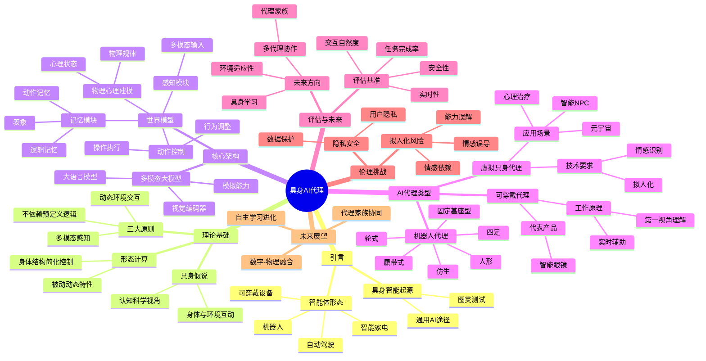

# Embodied AI Agents: Modeling the World
meta ai research
## Paper structure

## Sonme Definitions

## Conclusions
## Notes
- **生成式模型**存在一个根本性缺陷，即**模型规律效率低下**。其虽然擅长预测下一个标记或像素，但容易过度关注文本或视觉细节而忽视了推理与规划任务所需的很细信息。
- 

<BszComponent/>