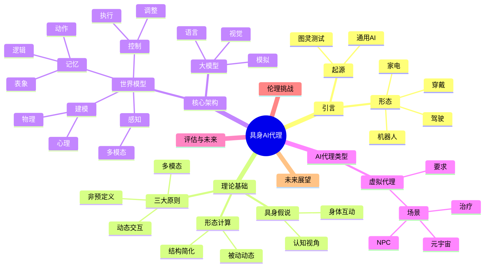
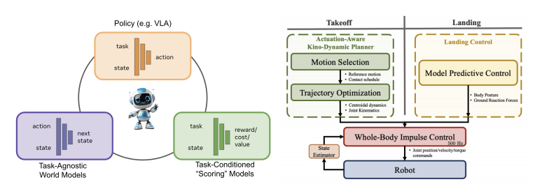
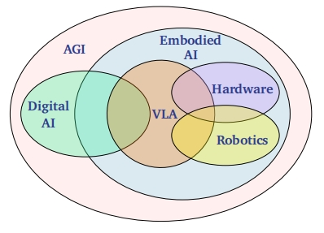

# Embodied AI Agents: Modeling the World
meta ai research [paper_links](https://arxiv.org/pdf/2506.22355)
## Paper mindmap

## 关于VLA的一些摘抄（英译中）
这类模型通过视觉语言模型（VLMs）将通用世界知识与语言条件化相结合，理论上可实现开放集任务的定义。目前这类研究主要聚焦于通用抓取与放置行为，旨在实现对新环境和物体的泛化能力。高质量数据生成（即清洁的远程操作数据）是该领域工作的关键，也是当前面临的主要瓶颈。

另一方面，通过强化学习（RL）在仿真环境中训练、专注于模拟到真实场景迁移的策略仍是一条充满潜力的发展方向。特别是深度强化学习（DRL）已成功应用于人形机器人躯干控制器的训练，用于完成移动导航任务及部分灵巧操作任务。但迄今为止，相关进展仍局限于那些能轻松设定奖励函数的任务类型。该研究方向面临的主要瓶颈包括：奖励函数设计、模拟到真实场景迁移*sim2real transefer*（受限于仿真场景的单一性及模拟器中物体交互物理参数的不精确性），以及如何将强化学习扩展至具有语言条件化任务设定的多任务策略体系。

这两种方法都存在一个根本性假设：泛化能力会随着数据规模的扩大而自然涌现（无论是通过远程操控还是模拟器交互），并且机器人智能体能够“一次性掌握所有知识后就能学会”。但现实情况是，我们是否真的能为机器人做好应对现实世界中所有可能遭遇的准备？甚至能否训练出能适应所有场景、涵盖所有技能的策略？与其试图强行实现这些目标，不如让机器人通过学习世界模型来理解自身行为对环境的影响，从而在测试推理阶段自主寻找新解决方案。世界模型作为利用有限领域数据实现通用机器人行为的有效途径，天然支持从多样化数据源（成功与失败的任务执行记录、视频数据、游戏数据）进行训练。我们最终认为，将策略模型、世界模型与“奖励”模型相结合的系统，将是开发通用型机器人智能体的最佳选择。

虽然本文讨论的是通过学习获得的动作条件化世界模型（并探讨不同动作抽象层次的世界模型），但无需在世界模型规划这一轴心上重新发明轮子。相反，我们可以借鉴或基于解析式模型在机器人控制领域的研究成果进行拓展。

机器人技术的终极目标是将系统部署到现实世界中。因此，真实场景评估堪称“黄金标准”。然而在现实环境中测试机器人既费时又难以实现可复现性。正因如此，机器人领域采用了三种基准测试*benchmarks*方式，在真实度、可复现性和规模之间进行权衡：
1. offline benchmark 通过真实数据评估机器人特定能力
2. Simulation Benchmarks 
3. Hardware Benchmarks

为了实现自主学习，AI系统必须整合被动感知和主动行为，同时从数据点级别转向任务级泛化，通过自我监督的任务发现和交互驱动的学习实现快速适应

> 核心论点：实现通用具身智能需要整合两种学习范式

为了实现像动物一样能够持续自主学习的AI系统，我们必须打破当前AI领域中学习和行动分离的现状。作者提出，未来的方向是构建一个能够将**被动观察学习**和**主动交互学习**融合在一起的统一架构。

文章将现有的学习算法归纳为两大系统：

**系统A：基于观察的学习 (Learning by Observation)**
- **是什么**：指从被动的感官数据（如图像、文本）中提取模式和抽象知识的学习方法，主要包括自监督学习、无监督学习等。
- **优点**：扩展性好，能从海量数据中学到有用的高级特征，适合迁移学习。
- **缺点**：
    1.  需要大量精心策划的数据集。
    2.  无法主动判断哪些数据是重要的。
    3.  学到的知识与现实世界的行动脱节（不“接地气”）。
    4.  难以分清相关性和因果性。

**系统B：基于行动的学习 (Learning by Action)**
- **是什么**：指通过与环境互动来学习的方法，最典型的例子就是强化学习（Reinforcement Learning）。
- **优点**：
    1.  学习到的能力是与物理世界直接相关的（“接地气”）。
    2.  能够进行实时自适应行为。
    3.  可以通过探索发现全新的解决方案。
- **缺点**：
    1.  **样本效率极低**，需要海量的交互才能学会简单任务。
    2.  在复杂、高维的动作空间中难以学习。
    3.  严重依赖于精心设计的奖励函数。

---

**两大系统的融合与互补**

文章的核心在于，这两个系统单独使用都有根本性的局限，但将它们结合起来可以形成一个强大的学习循环，互相弥补对方的不足。

1.  **系统A 帮助 系统B**：
    * **如何帮助**：系统A可以先从大量数据中学习到一个关于世界的**抽象模型**或**压缩表示**（例如世界模型）。系统B（强化学习）就可以在这个高效的抽象模型中进行规划和“想象”，而不是在真实世界中进行低效的试错。
    * **结果**：这极大地提高了系统B的学习效率，使其在复杂任务中的学习变得可行。

2.  **系统B 帮助 系统A**：
    * **如何帮助**：系统A依赖被动数据，但系统B可以通过**主动探索**来为系统A收集更有价值、更具信息量的数据。这就像吉布森（Gibson）所说的“我们为了移动而看，也为了看而移动”（主动感知）。
    * **结果**：系统B解决了系统A的数据来源问题，能够生成包含**（行动，结果）**的配对数据，帮助系统A将抽象知识与物理世界的因果关系联系起来，使其知识“落地”。

**未来方向**
为了实现这一整合框架，未来的研究需要：
- **架构创新**：设计能同时支持这两种学习模式的AI架构。
- **新的评估标准**：评估重点应从在固定基准上的性能，转移到系统学习新任务的**速度和效率**上。
-  **大力投资模拟器**：需要能够大规模、程序化地生成多样化任务和环境的强大模拟器，以支持这种结合了自监督学习和强化学习的预训练过程。

**总而言之，未来的具身AI应该是一个“感知指导行动，行动反过来优化感知”的闭环系统。**
## Other Notes

- **生成式模型**存在一个根本性缺陷，即**模型规律效率低下**。其虽然擅长预测下一个标记或像素，但容易过度关注文本或视觉细节而忽视了推理与规划任务所需的很细信息。
- VLM > LLM and Diffusion model > GPT 但是VLM任存在动作规划幻觉问题
- 用触觉补偿视觉
- 世界模型的构建受两大设计要素影响：
  - 时间维度和动作语义颗粒度的差异
    - 涉及机器人动作所需的低级动态参数——例如每隔几毫秒就会变化的关节扭矩
    - 另一方面则包含需要持续数秒甚至数分钟的人类尺度操作（如“插入电池”
  - 建模方法的选择
    - generative model：表达力强但成本高昂，因为它们试图捕捉场景中的每一个底层细节。
    - LLM：由于训练数据中存在虚假关联，容易产生幻觉现象。
    - joint-embedding world models：高效且稳定但实用性取决于该抽象如何捕捉任务的因果结构
- 心智模型：预判用户目标与意图；识别信念差异（？当对话中一方误认为某物品位于特定位置而另一方掌握真相时，模型能推断出信念偏差，并预测持错误认知者的行为模式。）；预判情绪反应

# A Survey on Vision-Language-Action Models:An Action Tokenization Perspective
peking university [paper_links](https://arxiv.org/pdf/2507.01925)
<BszComponent/>

---

## 一、重要定义 (Important Definitions)

1.  **视觉-语言-动作模型 (Vision-Language-Action Model, VLA)**
    * **定义**：这是一种具身智能模型，它能够接收多模态输入（主要是**视觉**图像和**语言**指令），并输出一系列**动作**指令，以驱动机器人在物理世界中完成任务。它是连接大型语言模型（LLM）的抽象智能与现实世界物理交互的桥梁。

2.  **动作符号化 (Action Tokenization)**
    * **定义**：这是论文提出的核心概念，指 VLA 模型将一个复杂的物理任务**分解**并**表示**为一连串标准化的、离散的“**动作符号**”的过程。这个过程是 VLA 模型从“理解”到“执行”的转换关键。

3.  **动作符号 (Action Token)**
    * **定义**：它是 VLA 模型内部生成的一种**中间表示（intermediate representation）**，用于编码执行任务所需的动作信息。它不是最终的电机指令，而是通往最终指令的关键步骤。论文将它分为8种基本类型：
        * **语言描述 (Language)**: `“grasp the red apple”`
        * **代码 (Code)**: `robot.pick("apple")`
        * **可供性/示能 (Affordance)**: `预测苹果是“可抓取”的`
        * **轨迹 (Trajectory)**: `一系列(x, y, z)坐标点`
        * **目标状态 (Goal State)**: `一张机械臂已经抓住苹果的图片`
        * **潜在表示 (Latent Representation)**: `一个抽象的、不可读的数学向量`
        * **原始动作 (Raw Action)**: `关节角度、速度等底层控制量`
        * **推理 (Reasoning)**: `“To get the apple, I first need to open the drawer”`

---

## 二、方法 (Methods)

由于这是一篇综述（Survey）论文，其“方法”并非提出一个新模型，而是提出一套**分析和归纳现有研究的方法论**。

1.  **提出统一分析框架 (Proposing a Unified Framework)**
    * 论文的方法是，首先构建一个普适性的 VLA 流程框架：`（视觉/语言输入）-> 编码器 -> 策略模块 -> 生成动作符号 -> （动作解码器）-> 物理执行`。

2.  **建立分类体系 (Creating a Taxonomy)**
    * 以“动作符号”作为**核心分类标准**，将数百篇看似无关的 VLA 研究论文分门别类，归入前述定义的8个类别中。这是本文的核心研究方法。

3.  **系统性回顾与比较 (Systematic Review and Comparison)**
    * 对每个类别下的代表性工作进行系统性的文献回顾。
    * 采用**优点-局限性 (Advantages-Limitations)**的分析方法，对每一种“动作符号”的适用场景、技术挑战和性能特点进行横向和纵向的比较分析。

---

## 三、结论 (Conclusions)

1.  **“动作符号化”视角是理解VLA模型的有效范式。**
    * 论文得出结论，这个视角能够清晰地揭示不同 VLA 模型设计的本质区别，为整个领域提供了一个统一且强大的分析工具。

2.  **不存在“最优”的动作符号，只有“最适合”的。**
    * 每种动作符号都有其固有的优缺点。例如，语言/代码等抽象符号适合**高层、长时程的任务规划**；而轨迹/原始动作等具体符号则适合**底层、精细的实时控制**。任务的性质决定了最适合的符号类型。

3.  **未来发展趋势是层次化与混合化 (Hierarchical and Hybrid)。**
    * 论文断定，最强大的未来 VLA 模型将**不会只使用单一类型的动作符号**。
    * 结论是，未来的模型会是一个**层次化系统**：利用抽象符号（如语言）进行高层战略规划，再由下游模块将其解析为更具体的符号（如轨迹）来精确执行。

---

## 四、意义 (Significance)

1.  **为领域提供了“共同语言”和“学术地图”。**
    * 在一个新兴且混乱的领域，这篇论文首次提供了一个清晰的“地图”和一套“共同语言”（即动作符号的分类）。这极大地降低了新研究者的入门门槛，也让资深研究者能更清晰地定位自己的工作。

2.  **指导未来的模型设计与技术选型。**
    * 对于机器人系统开发者而言，这篇论文相当于一本**设计指南**。他们可以根据具体的任务需求，参考论文中对不同动作符号的分析，来做出更明智的技术选型决策。

3.  **揭示了关键挑战并指明了未来方向。**
    * 通过系统性的梳理，论文清晰地暴露了当前 VLA 研究中的空白点和核心挑战（如如何高效结合不同符号、如何提升推理效率等），为整个领域未来的研究议程设定了方向。

4.  **加速通往通用机器人智能的进程。**
    * 通过建立这样一个基础性的理论框架，论文将促进 VLA 领域更加系统化、标准化的发展，避免了研究的碎片化，从而整体上加速了实现能够理解人类意图并在复杂环境中自主行动的通用机器人的进程。

# A Survey: Learning Embodied Intelligence from Physical Simulators and World Models
[paper link](https://arxiv.org/pdf/2507.00917)

本论文全面综述了通过物理模拟器（Physical Simulators）和世界模型（World Models）学习具身智能（Embodied Intelligence）的最新进展。具身智能是通往通用人工智能（AGI）的关键，它强调智能体在物理世界中进行感知、推理和行动的能力。物理模拟器提供了受控、高保真的环境，用于训练和评估机器人，而世界模型则使机器人能够构建内部环境表征，实现预测性规划和自适应决策。本研究通过系统回顾这两种核心技术，分析它们在提升智能机器人自主性、适应性和泛化能力方面的互补作用，并探讨了外部模拟训练与内部建模之间如何弥合仿真与现实部署的鸿沟。

论文主要贡献包括：
1.  **具身智能机器人分级标准（Levels of Intelligent Robots）**：提出了一个涵盖四个关键维度（自主性Autonomy、任务处理能力Task Handling Ability、环境适应性Environmental Adaptability、社会认知能力Societal Cognition Ability）的五级（IR-L0至IR-L4）智能机器人能力评估标准。IR-L0（基础执行级Basic Execution）指完全依赖人类控制或预定义程序的机器人，如工业焊接机器人。IR-L1（程序响应级Programmatic Response）指具备有限规则响应能力，能在封闭环境中执行预定义任务序列的机器人，如清洁机器人。IR-L2（基础感知与适应级Basic Perception and Adaptation）指拥有初步环境感知和自适应能力的机器人，如能根据语音指令进行路径规划和避障的服务机器人。IR-L3（类人认知与协作级Humanoid Cognition and Collaboration）指能在复杂动态环境中进行自主决策，并支持高级多模态人机交互的机器人。IR-L4（完全自主级Fully Autonomous）指在感知、决策和执行方面完全自主，具备自我进化道德推理、高级认知、共情和长期自适应学习能力的机器人。
2.  **机器人学习技术分析（Analysis of recent techniques of robot learning）**：系统回顾了腿式运动（legged locomotion）、灵巧操作（manipulation）和人机交互（human-robot interaction, HRI）领域的最新技术进展。
    *   **机器人运动（Robotic Locomotion）**：包括非结构化环境适应（Unstructured Environment Adaption）和高动态运动（High Dynamic Movements）。非结构化环境适应强调在复杂、未知或动态地形中保持稳定行走的能力，例如在崎岖山路或楼梯上。高动态运动则关注在高速、动态动作（如奔跑、跳跃）中平衡稳定性和敏捷性。此外，还探讨了机器人跌倒保护（fall protection）与恢复（recovery）策略。相关技术包括模型预测控制（Model Predictive Control, MPC）、全身控制（Whole-Body Control, WBC）、强化学习（Reinforcement Learning, RL）和模仿学习（Imitation Learning, IL）。
    *   **机器人操作（Robotic Manipulation）**：涵盖了单手操作（Unimanual Manipulation）、双手协调操作（Bimanual Manipulation）和全身操作（Whole-Body Manipulation Control）。单手操作从夹持器（gripper-based）到灵巧手（dexterous hand）操作，涉及抓取、放置、工具使用等任务。双手协调操作则聚焦于需要两臂协同的复杂任务，如协同搬运和精确装配。全身操作是指机器人利用全身部件（包括双臂、躯干、底座等）与物体交互的能力。视觉-语言-动作模型（Visual-Language-Action Models, VLA）和基础模型（Foundation Models, FMs）在此领域展现出强大潜力。
    *   **人机交互（Human-Robot Interaction, HRI）**：围绕认知协作（Cognitive Collaboration）、物理可靠性（Physical Reliability）和社会嵌入性（Social Embeddedness）三个维度展开。认知协作强调机器人理解人类意图和动态适应的能力；物理可靠性关注人机物理交互中的力、时序和距离协调，确保安全高效；社会嵌入性则指机器人识别并适应社会规范、文化预期和群体动态的能力。
3.  **主流物理模拟器分析（Analysis of current physical simulators）**：全面比较了Webots、Gazebo、MuJoCo、PyBullet、CoppeliaSim、Isaac Gym/Sim/Lab、SAPIEN和Genesis等主流模拟器，评估其物理模拟能力（如吸附Suction、随机外力Random external forces、可变形物体Deformable objects、软体接触Soft-body contacts、流体机制Fluid mechanism、离散元方法DEM simulation、可微分物理Differentiable physics）、渲染能力（Rendering Engine、光线追踪Ray Tracing、基于物理的渲染Physically-Based Rendering、可扩展并行渲染Scalable Parallel Rendering）以及传感器和关节类型支持（Sensor and Joint Component Types）。虽然模拟器在成本效益、安全性和可重复性方面具有优势，但其准确性、复杂性、数据依赖性和过拟合等挑战，促使了世界模型的发展。
4.  **世界模型的最新进展（Recent advancements of World Models）**：
    *   **世界模型的代表性架构（Representative Architectures of World Models）**：回顾了世界模型的架构演变，包括循环状态空间模型（Recurrent State Space Model, RSSM）、联合嵌入预测架构（Joint-Embedding Predictive Architecture, JEPA）、基于Transformer的状态空间模型（Transformer-based State Space Models）、自回归生成世界模型（Autoregressive Generative World Models）和基于扩散的生成世界模型（Diffusion-based Generative World Models）。这些模型在状态编码、时间依赖处理和未来观测生成方面各有侧重，共同推动了世界模型向更高保真度和可控性发展。
    *   **世界模型的核心作用（Core Roles of World Models）**：世界模型扮演着三个核心角色：
        *   **神经模拟器（Neural Simulator）**：通过生成可控、高保真的合成经验，为自动驾驶和机器人训练提供可扩展的环境，例如NVIDIA的Cosmos系列和Wayve的GAIA系列。它们能基于文本、图像、轨迹等多种输入合成时间一致、语义明确的视频或3D场景。
        *   **动态模型（Dynamic Models）**：在基于模型的强化学习（Model-based Reinforcement Learning, MBRL）中，世界模型学习环境的底层物理和运动模式，预测未来状态或观测，从而实现规划和决策。Dreamer系列是此方向的代表，通过学习紧凑的潜在动态来高效地学习策略。
        *   **奖励模型（Reward Models）**：通过学习专家演示的潜在动态和结构，世界模型可以作为隐式奖励模型，根据智能体行为产生轨迹的可预测性来推断奖励，从而解决奖励函数难以手动设计的问题，例如VIPER模型。
5.  **世界模型在智能机器人中的应用（World Models for Intelligent Robots）**：
    *   **自动驾驶世界模型（World Models for Autonomous Driving）**：传统自动驾驶模块化架构面临错误累积和泛化能力不足的问题。基于视频生成的自动驾驶世界模型则通过学习环境动态、预测未来场景，弥合了这些局限。本节将自动驾驶世界模型分为神经模拟器、动态模型和奖励模型三类。
        *   **WMs作为自动驾驶的神经模拟器**：这类模型专注于生成逼真的驾驶场景以训练和测试自动驾驶系统，例如GAIA-1/2、DriveDreamer系列、MagicDrive系列、WoVoGen、OccSora、DriveWorld等，它们能够基于多模态输入生成高保真、多视角一致、3D感知的驾驶视频或4D占据表示，实现对天气、交通、车辆轨迹的精细控制。
        *   **WMs作为自动驾驶的动态模型**：这类模型学习驾驶环境的物理和运动模式，主要服务于感知、预测和规划任务。例如MILE、TrafficBots、UniWorld、OccWorld、ViDAR等，通过学习潜在空间动态、多智能体行为或4D占据预测，提升系统对环境动态的理解和决策能力。
        *   **WMs作为自动驾驶的奖励模型**：这类模型评估驾驶行为的质量和安全性，常与强化学习结合进行策略优化。例如Vista、WoTE、Drive-WM、Iso-Dream等，利用世界模型的预测能力评估潜在驾驶机动的安全性和结果，提供内在奖励信号。
    *   **自动驾驶世界模型的技术趋势**：主要包括四个方面：生成架构从自回归模型向扩散模型演进；多模态集成和可控场景生成；3D时空理解和基于占据（Occupancy-Based Representations）的表示方法；以及与自动驾驶流程的端到端集成。

本综述为理解具身智能的发展路径提供了全面的视角，强调了物理模拟器与世界模型在推动机器人走向更自主、更智能未来的关键作用。

---
**核心方法和技术术语的详细解释**

*   **具身智能（Embodied Intelligence）**：指智能体通过物理身体在物理世界中进行感知、推理和行动的能力。与仅处理符号或数字数据的非具身智能不同，具身智能强调物理交互的重要性，使机器人能够从经验中学习，并根据物理世界反馈持续调整行为和认知。
*   **物理模拟器（Physical Simulators）**：提供高保真物理引擎和渲染能力的软件环境，用于在虚拟空间中模拟机器人及其环境的物理交互。例如：
    *   **Gazebo**：广泛使用的开源机器人模拟器，以其可扩展性和与机器人操作系统（Robot Operating System, ROS）的集成而闻名。
    *   **MuJoCo (Multi-Joint dynamics with Contact)**：专注于多关节系统和接触动力学的高精度物理引擎，常用于强化学习任务。
    *   **Isaac Sim/Lab**：NVIDIA开发的GPU加速模拟平台，结合PhysX物理引擎和RTX光线追踪渲染，支持大规模并行仿真和高质量传感器模拟。
    *   **Differentiable Physics (可微分物理)**：指模拟器能够计算物理状态相对于输入参数（如控制信号、物体姿态、物理属性）的梯度。这一能力使得模拟器能与机器学习模型无缝集成，实现端到端优化和学习，显著提高强化学习和控制算法的效率。
*   **世界模型（World Models）**：生成式AI模型，能够学习并理解真实世界的动态、物理和空间属性，从而构建环境的内部表征。这些模型使智能体能够在内部模拟未来状态并规划行动。
    *   **循环状态空间模型（Recurrent State Space Model, RSSM）**：一种世界模型架构，使用紧凑的潜在空间编码环境的演变状态，并通过循环结构（如循环神经网络Recurrent Neural Network, RNN）模拟其时间动态。代表性工作是Dreamer系列。
    *   **联合嵌入预测架构（Joint-Embedding Predictive Architecture, JEPA）**：由Yann Lecun提出，旨在以纯粹自监督的方式预测缺失内容的抽象级表征。它通过在潜在空间中预测被遮蔽区域的表征来学习，而不是直接重建原始观测，从而实现语义抽象和数据效率。
    *   **基于Transformer的状态空间模型（Transformer-based State Space Models）**：用基于注意力机制的Transformer取代RNN来建模潜在空间中的时间动态，以更好地捕捉长距离依赖，提升长时序一致性和规划性能。
    *   **自回归生成世界模型（Autoregressive Generative World Models）**：将世界建模视为基于tokenized视觉观测的序列预测任务，利用Transformer架构根据过去上下文生成未来观测，常集成多模态输入（如动作或语言）。
    *   **基于扩散的生成世界模型（Diffusion-based Generative World Models）**：利用扩散模型（Diffusion Models）的优势，通过迭代去噪从噪声中生成高质量、时间一致的视觉序列。这类模型在视觉真实感和建模3D结构与物理动态方面表现出色，如OpenAI的Sora。
*   **模型预测控制（Model Predictive Control, MPC）**：一种基于优化的控制策略，利用系统动态模型预测未来行为，并在每个时间步解决一个优化问题来计算控制动作，以显式处理输入和状态约束。
*   **全身控制（Whole-Body Control, WBC）**：机器人学中的一个综合框架，使机器人能够同时协调所有关节和肢体以实现不同运动，通常通过将运动和力目标表述为一系列优先级任务并通过优化技术求解。
*   **强化学习（Reinforcement Learning, RL）**：机器学习的一个分支，智能体通过与环境交互并接收奖励或惩罚信号，自主学习执行复杂任务的最优策略。
*   **模仿学习（Imitation Learning, IL）**：机器人通过观察和模仿（通常由人类或其他智能体提供）演示来学习执行任务，从而避免显式编程或手动设计奖励函数。
*   **视觉-语言-动作模型（Visual-Language-Action Models, VLA）**：一种跨模态AI框架，整合视觉感知、语言理解和动作生成，利用大型语言模型（Large Language Models, LLMs）的推理能力将自然语言指令直接映射到物理机器人的动作。
*   **基于占据的表示（Occupancy-Based Representations）**：在世界模型和自动驾驶中，指通过占据栅格（occupancy grid）或4D占据（4D occupancy）等方式表示场景的3D结构和时间动态，编码空间占用信息，有助于更精确的3D几何理解。
*   **模型驱动强化学习（Model-based Reinforcement Learning, MBRL）**：在强化学习中，智能体首先构建一个环境的内部模型（包括动态模型和奖励模型），然后利用这个模型来模拟与环境的交互，从而进行规划或策略学习，以提高样本效率。