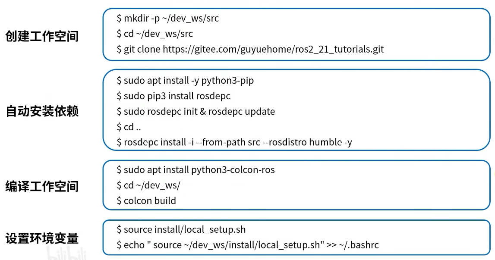
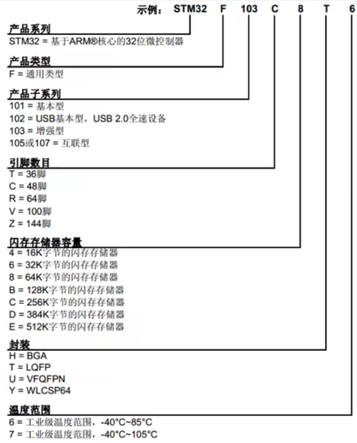
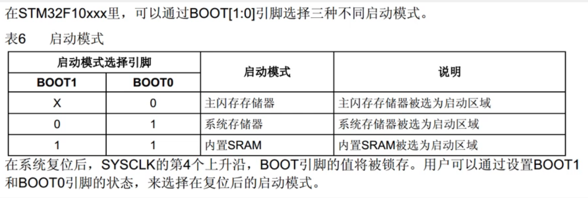
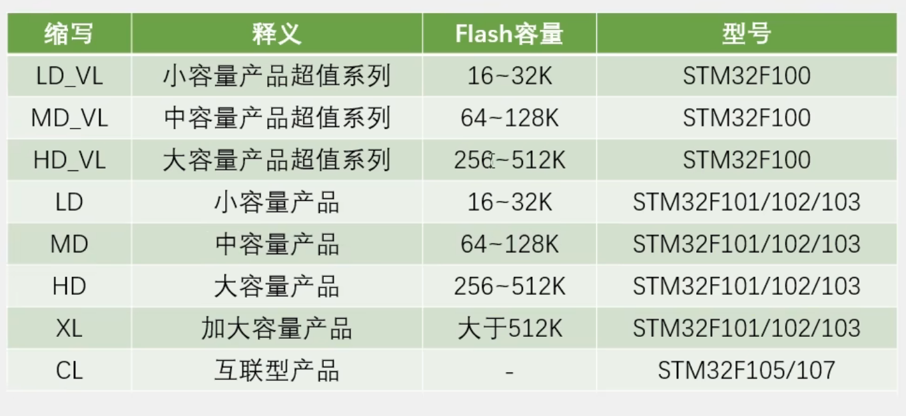
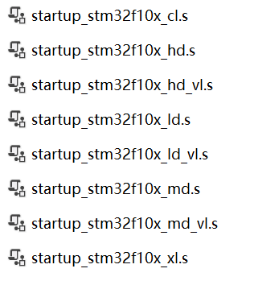
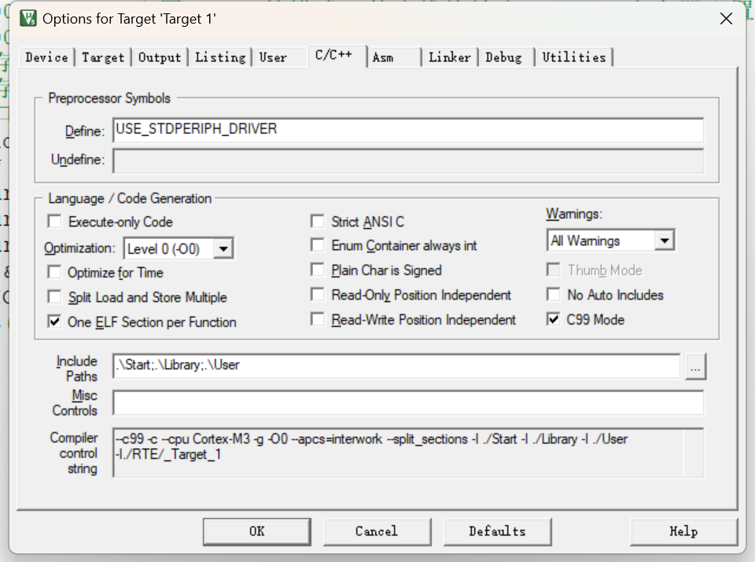
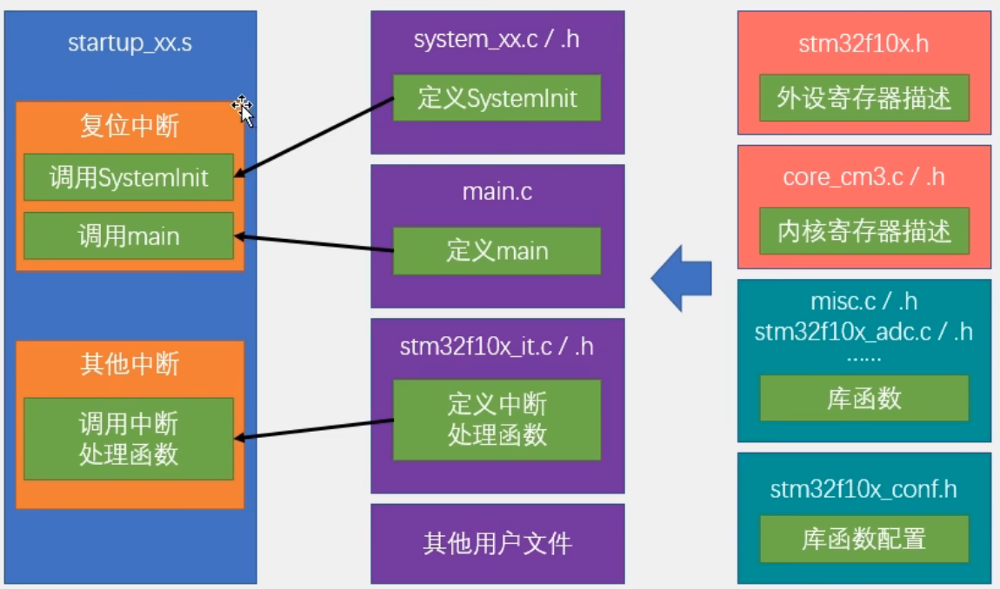

> 基于江科大的stm32学习于2025.2.5启动，希望10号前能多学点！
---
## stm32简介
### stm32介绍
- STM32是ST公司基于ARM Cortex-M内核开发的32位微控制器（M——Microcontroller ）
- STM32常应用在嵌入式领域如智能车、无人机、机器人无线通信、物联网、工业控制、娱乐电子产品等
- STM32功能强大、性能优异片上资源丰富、功耗低，是一款经典的嵌入式微控制器
  
### ARM介绍
- ARM既指ARM公司，也指ARM处理器内核
- ARM公司是全球领先的半导体知识产权(IP)提供商，全世界超过95%的智能手机和平板电脑都采用ARM架构（它卖方案）
- ARM公司设计ARM内核，半导体厂商完善内核周边电路并生产芯片

### STM32F103C8T6
- 系列:主流系列STM32F1
- 内核:ARM Cortex-M3
- 主频:72MHZ(SRAM)
- RAM :20K
- ROM :64K(Flash)
- 供电:2.0~3.6V(标准3.3V)
- 封装:LQFP48

### 片上资源/外设

(英文是peripheral)

- NVIC：用于内核里面管理中断，配置中断优先级
- Systick：内核里的定时器，主要用来给操作系统提供定时服务，进行任务切换；stm32可以加入操作系统，例如freeRTOS，UCOS（江科课程不涉及操作系统）
- RCC：用于外设时钟的使能（stm32外设在上电情况下默认是没有时钟的；无时钟时，操作外设是无效的，目的是为了减少功耗；所以在操作外设之前必须使能它的时钟）
- 看门狗：当单片机因为电磁干扰死机或者程序设计不合理出现死循环时，看门狗可以及时复位芯片，保证系统的稳定
（c8t6没有后四个外设，详情去看datasheet）

### 命名规则


### 启动配置
 


---
## 软件安装
---
## 新建工程模板 
### 关于启动文件


### 用配置寄存器和库函数的方法点亮一颗灯
```c
#include "stm32f10x.h"                  // Device header
int main()
{
	/*RCC->APB2ENR = 0x00000010;//打开GPLC的时钟
	GPIOC->CRH = 0x00300000;//配置PC13口的模式，什么推挽输出blabla，寄存器配置，具体看原理图
	GPIOC->ODR = 0x00000000;//灯是低电平点亮的，等等我的和江科是相反的*/
	//1. 配置时钟寄存器
	//2. 配置GPIO寄存器模式
	//3. 配置GPIO端口输出寄存器
	RCC_APB2PeriphClockCmd(RCC_APB2Periph_GPIOC,ENABLE);
	GPIO_InitTypeDef GPIO_InitStructure;
	GPIO_InitStructure.GPIO_Mode = GPIO_Mode_Out_PP;
	GPIO_InitStructure.GPIO_Pin = GPIO_Pin_13;
	GPIO_InitStructure.GPIO_Speed = GPIO_Speed_50MHz;
	GPIO_Init(GPIOC,&GPIO_InitStructure);
	GPIO_SetBits(GPIOC,GPIO_Pin_13);
	//GPIO_ResetBits(GPIOC,GPIO_Pin_13);
	while(1)
	{
		
	}
}
```
用库函数的话有许多前置条件，你要有start启动文件，library装依赖的库函数，user装你的main函数啥的，好难🤯

### 新建工程的步骤
  1. 建立工程文件夹，Kei中新建工程，选择型号
  2. 工程文件夹里建立Start、Library、User等文件夹，复制固件库里面的文件到工程文件夹
  3. 工程里对应建立Start、Library、User等同名称的分组，然后将文件夹内的文件添加到工程分组里
  4. 工程选项，C/C++，Include Paths内声明所有包含头文件的文件夹
   
  5. 工程选项，C/C++，Define内定义USE STDPERIPH DRIVER
  6. 工程选项，Debug，下拉列表选择对应调试器，Settings，FlashDownload里勾选Reset and Run

### 工程架构


结束，2025/2/6 0:00;好难。

---
